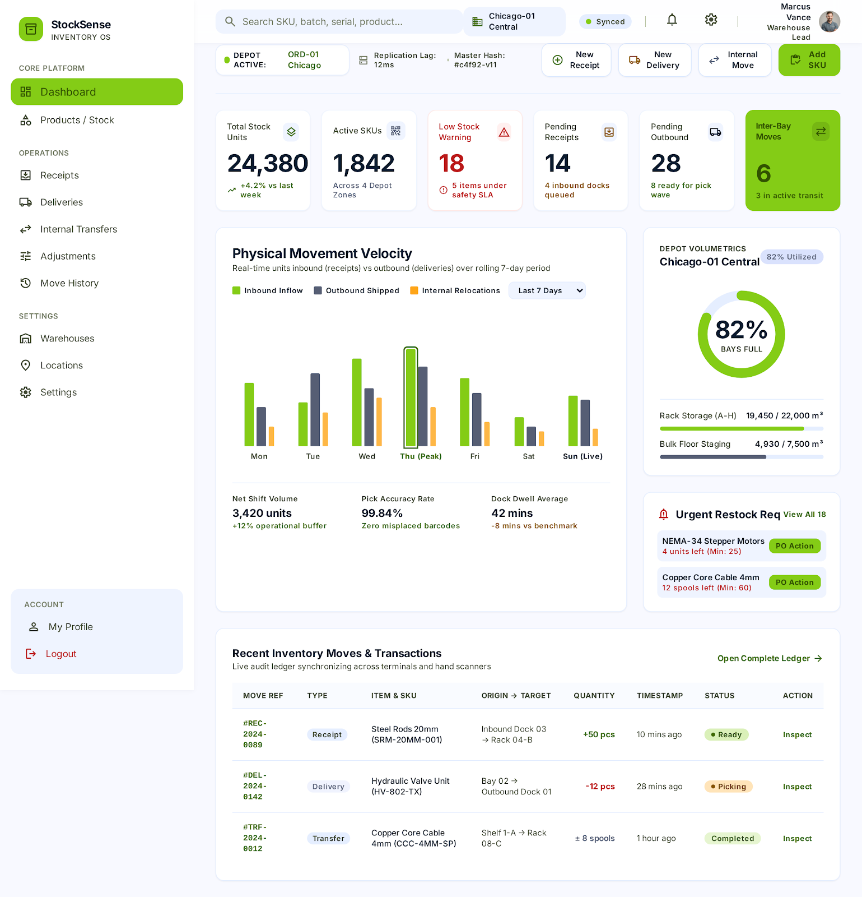

# StockSense — Inventory Management System

> Odoo Hackathon submission · FastAPI backend · vanilla-JS single-page frontend



---

## Table of Contents

1. [What we built](#1-what-we-built)
2. [Beyond the brief — what we added and why](#2-beyond-the-brief)
3. [Tech stack](#3-tech-stack)
4. [Quick start (< 5 minutes)](#4-quick-start)
5. [Demo accounts](#5-demo-accounts)
6. [Configuration reference](#6-configuration-reference)
7. [API overview](#7-api-overview)
8. [Role permissions](#8-role-permissions)
9. [Running the tests](#9-running-the-tests)
10. [Project structure](#10-project-structure)

---

## 1. What we built

StockSense replaces manual stock registers and spreadsheets with a centralized,
real-time inventory system for **Inventory Managers** and **Warehouse Staff**.

| Module | What it does |
|--------|-------------|
| **Products** | Create, search (name/SKU/category/status), archive, view stock per location |
| **Operations** | Receipts, Deliveries, Internal Transfers, Adjustments — each with a full status workflow |
| **Move History** | Immutable ledger of every stock movement with the user who made it |
| **Dashboard** | KPI cards — total stock, pending ops, low-stock count, valuation snapshot |
| **Alerts** | In-app notification bell: low stock, out-of-stock, approvals needed |
| **Reports** | Inventory valuation, fast/slow movers, dead stock, CSV export |
| **Import** | Bulk product import from CSV or Excel with dry-run preview |
| **Warehouses** | Multi-warehouse with named locations; filter every view by warehouse |
| **Auth** | JWT login, signup, OTP password reset, manager/staff roles, user management |

---

## 2. Beyond the brief

The brief described what to build but left several gaps. Here is what we found and how we closed each one.

| Gap in the brief | Our solution |
|---|---|
| Brief aims to replace Excel but has no way to import it | CSV/Excel import (`POST /api/import/products`) with dry-run preview, row-level errors/warnings, column-alias tolerance, template download |
| Reordering rules are listed but do nothing | Low-stock engine: suggested order qty (accounts for incoming stock already on order), days of cover, one-click auto-reorder that drafts a receipt (`POST /api/operations/reorder`) |
| No roles or permissions — anyone can change stock | Manager / Staff roles enforced at the API layer; managers-only: approve adjustments, reverse operations, add locations, archive products, commit imports, manage users |
| Adjustments can silently change stock | Mandatory reason codes on every adjustment; adjustments above the threshold (default 10 units) require a manager approval; the creator cannot approve their own adjustment |
| Nothing prevents negative stock or double-booking | Stock is reserved on confirm; validation is all-or-nothing; negative stock raises `409 InsufficientStock` |
| No audit trail and no undo | Every movement is written to an immutable stock ledger with the actor identity; `POST /api/operations/{id}/reverse` creates a new linked reversal operation instead of deleting data |
| Status list exists but no enforced rules | Workflow: `Draft → Waiting / Ready → Done`; cancel only before Done; reverse only after Done |
| Quantities only, no monetary value | Inventory valuation (total, by category, by warehouse) + fast/slow movers + dead stock via `GET /api/reports/valuation` and `GET /api/reports/movers` |
| Alerts are mentioned but not defined | AlertCenter scans stock on every read request; raises low-stock, out-of-stock, and approval-needed alerts; auto-resolves when fixed; no duplicates |

---

## 3. Tech stack

**Backend**

| | |
|---|---|
| Language | Python 3.11+ |
| Framework | FastAPI 0.110+ |
| Auth | PyJWT (HS256), bcrypt, 6-digit OTP reset |
| Database | PostgreSQL via Supabase (SQLAlchemy 2 + psycopg3); falls back to in-memory if `DATABASE_URL` is not set |
| Excel import | openpyxl |
| Tests | pytest 8 + httpx (43 tests) |

**Frontend**

| | |
|---|---|
| Structure | Single HTML file (`frontend/code.html`) |
| Styling | Tailwind CSS (CDN) + Material Design tokens |
| Logic | Vanilla JS modules (`frontend/js/`) |
| Auth | JWT stored in `localStorage`; `Authorization: Bearer` on every API call |

---

## 4. Quick start

### Prerequisites

- Python 3.11 or newer
- A Supabase project **or** skip the database step to run in-memory (data resets on restart)

---

### Step 1 — Clone

```bash
git clone https://github.com/liakhath/Stock-Sense-Hackathon.git
cd Stock-Sense-Hackathon
```

### Step 2 — Install backend dependencies

```bash
cd stocksense-backend
python -m pip install -r requirements.txt
```

### Step 3 — Create the environment file

```bash
copy .env.example .env
```

Open `stocksense-backend/.env` and fill in **at minimum**:

```ini
# Paste your Supabase Session pooler URI (leave empty to use in-memory storage)
DATABASE_URL=postgresql+psycopg://...

# Generate a secret:  python -c "import secrets; print(secrets.token_urlsafe(48))"
JWT_SECRET=<your-random-secret>
```

All other settings have working defaults (see [Configuration reference](#6-configuration-reference)).

### Step 4 — Initialise the database (skip if using in-memory)

```bash
python -m app.db.manage status
```

This creates all tables and prints row counts. Demo data is seeded automatically on the first server start.

### Step 5 — Start the backend

```bash
python -m uvicorn app.main:app --port 8000
```

Verify: `http://localhost:8000/api/health` should return `{"status":"ok","storage":"database","auth_required":true}`.

Interactive API docs: `http://localhost:8000/docs`

### Step 6 — Start the frontend

Open a **second terminal** in the repo root:

```bash
python -m http.server 5500 --directory frontend
```

Open `http://localhost:5500/code.html` in your browser and log in with a demo account.

> **Note:** The backend's default CORS allows `localhost:5500` out of the box.
> If you serve the frontend from a different port, add it to `CORS_ORIGINS` in `.env`.

---

## 5. Demo accounts

These are seeded automatically on a fresh database (or in-memory mode):

| Role | Email | Password |
|------|-------|----------|
| Manager | `manager@stocksense.demo` | `demo1234` |
| Staff | `staff@stocksense.demo` | `demo1234` |

The **first** self-signup account also becomes a manager automatically.

> OTP demo mode is on by default: the password-reset response includes the 6-digit code
> so you can test the full flow without configuring SMTP.

---

## 6. Configuration reference

All settings live in `stocksense-backend/.env`.
Copy `.env.example` as a starting point — it contains comments for every key.

| Variable | Default | Description |
|----------|---------|-------------|
| `DATABASE_URL` | *(empty)* | Supabase Session pooler URI. Empty = in-memory (data lost on restart) |
| `AUTH_REQUIRED` | `true` | JWT required on every `/api` route |
| `JWT_SECRET` | *(none)* | **Set this.** Random secret used to sign tokens. If unset, everyone is logged out on every restart |
| `JWT_EXPIRE_MINUTES` | `720` | Token lifetime (12 hours) |
| `SEED_DEMO_DATA` | `true` | Seed products, locations, and demo users when the store is empty |
| `ADJUSTMENT_APPROVAL_THRESHOLD` | `10` | Adjustments changing stock by more than this many units require manager approval. Empty = approvals off |
| `OTP_DEMO_MODE` | `true` | Include the reset code in the API response (no email needed) |
| `CORS_ORIGINS` | `localhost:3000,5173,5500` | Comma-separated allowed origins |
| `SMTP_HOST / PORT / USER / PASSWORD / FROM` | *(empty)* | Optional — email the OTP reset code instead of returning it |

---

## 7. API overview

All data endpoints require `Authorization: Bearer <token>` (obtained from `/api/auth/login`).
Full interactive docs: `http://localhost:8000/docs`

### Auth — public

| Method | Path | Description |
|--------|------|-------------|
| `POST` | `/api/auth/signup` | Create a staff account; first user becomes manager |
| `POST` | `/api/auth/login` | Returns JWT + user object |
| `POST` | `/api/auth/forgot-password` | Issues a 6-digit OTP (returned in demo mode) |
| `POST` | `/api/auth/reset-password` | Verify OTP and set a new password |

### Auth — logged in

| Method | Path | Description |
|--------|------|-------------|
| `GET` | `/api/auth/me` | Current user |
| `POST` | `/api/auth/change-password` | Change own password |

### Auth — managers only

| Method | Path | Description |
|--------|------|-------------|
| `GET` | `/api/auth/users` | List all users |
| `POST` | `/api/auth/users` | Create a user with any role |
| `PATCH` | `/api/auth/users/{id}` | Update name, role, or active status |

### Products

| Method | Path | Description |
|--------|------|-------------|
| `GET` | `/api/products` | Search by name/SKU, filter by category/warehouse/stock status |
| `POST` | `/api/products` | Create a product |
| `GET` | `/api/products/{id}` | Get product |
| `PATCH` | `/api/products/{id}` | Update fields; `active: false` archives (managers only) |
| `GET` | `/api/products/{id}/stock` | Stock per location |
| `GET` | `/api/products/low-stock` | Low-stock list with suggested reorder qty and days of cover |
| `GET` | `/api/products/sku/{sku}` | SKU / barcode lookup |
| `GET` | `/api/products/categories` | All distinct categories |

### Operations

| Method | Path | Description |
|--------|------|-------------|
| `GET` | `/api/operations` | List (filter by type, status, warehouse, category) |
| `POST` | `/api/operations/receipts` | New receipt (stock in) |
| `POST` | `/api/operations/deliveries` | New delivery (stock out) |
| `POST` | `/api/operations/transfers` | New internal transfer |
| `POST` | `/api/operations/adjustments` | New stock adjustment (reason required) |
| `POST` | `/api/operations/reorder` | Auto-draft receipt for all low-stock products |
| `POST` | `/api/operations/{id}/confirm` | Draft → Waiting/Ready |
| `POST` | `/api/operations/{id}/check-availability` | Waiting → Ready (if stock available) |
| `POST` | `/api/operations/{id}/validate` | Ready → Done (moves stock) |
| `POST` | `/api/operations/{id}/approve` | Approve a pending adjustment (manager only; creator excluded) |
| `POST` | `/api/operations/{id}/cancel` | Cancel before Done |
| `POST` | `/api/operations/{id}/reverse` | Undo a Done operation (manager only); creates new reversal |

### Move History

| Method | Path | Description |
|--------|------|-------------|
| `GET` | `/api/ledger` | Every stock movement (filter by product, location, type, user, date range; max 1 000 rows) |

### Dashboard & Reports

| Method | Path | Description |
|--------|------|-------------|
| `GET` | `/api/dashboard/kpis` | Total stock, pending ops, low-stock count, today's movements |
| `GET` | `/api/reports/valuation` | Inventory value by category and warehouse |
| `GET` | `/api/reports/movers` | Fast movers, slow movers, dead stock (configurable window) |
| `GET` | `/api/reports/export/stock.csv` | Stock report CSV |
| `GET` | `/api/reports/export/ledger.csv` | Full ledger CSV |

### Alerts

| Method | Path | Description |
|--------|------|-------------|
| `GET` | `/api/alerts` | All alerts (newest first); refreshes on every call |
| `GET` | `/api/alerts/count` | Unread count (poll every 30 s for the notification bell) |
| `POST` | `/api/alerts/read-all` | Mark all read |
| `POST` | `/api/alerts/{id}/read` | Mark one read |

### Warehouses & Locations

| Method | Path | Description |
|--------|------|-------------|
| `GET` | `/api/warehouses` | List warehouse names |
| `GET` | `/api/locations` | List locations (filter by warehouse) |
| `POST` | `/api/locations` | Add a location (manager only) |

### Import

| Method | Path | Description |
|--------|------|-------------|
| `GET` | `/api/import/products/template` | Download CSV template |
| `POST` | `/api/import/products?dry_run=true` | Preview import — all users |
| `POST` | `/api/import/products?dry_run=false` | Commit import — manager only |

---

## 8. Role permissions

| Action | Staff | Manager |
|--------|:-----:|:-------:|
| View products, operations, history, reports | ✅ | ✅ |
| Create receipt / delivery / transfer / adjustment | ✅ | ✅ |
| Confirm, validate, cancel operations | ✅ | ✅ |
| Preview CSV/Excel import (dry run) | ✅ | ✅ |
| Approve adjustment (own adjustment: ❌) | ❌ | ✅ |
| Reverse a Done operation | ❌ | ✅ |
| Archive / restore a product | ❌ | ✅ |
| Add a warehouse location | ❌ | ✅ |
| Commit a CSV/Excel import | ❌ | ✅ |
| Manage users (list, create, edit, activate) | ❌ | ✅ |

---

## 9. Running the tests

```bash
cd stocksense-backend
python -m pytest -q
```

Expected output: **43 passed**.

| File | Covers |
|------|--------|
| `test_stock_engine.py` | Core stock engine logic |
| `test_api.py` | HTTP endpoints via httpx test client |
| `test_auth.py` | Login, signup, OTP reset, role enforcement |
| `test_services.py` | Import, analytics, alert services |
| `test_schemas.py` | Pydantic schema validation |
| `test_db.py` | Database persistence (skipped when `DATABASE_URL` is not set) |

---

## 10. Project structure

```
Stock-Sense-Hackathon/
├── stocksense-backend/          # FastAPI backend
│   ├── app/
│   │   ├── api/
│   │   │   ├── deps.py          # FastAPI dependencies (auth, engine, manager guard)
│   │   │   └── routes/          # One file per resource group
│   │   ├── auth/                # JWT, bcrypt, OTP, user repository
│   │   ├── db/                  # SQLAlchemy tables, PersistentStore, manage.py
│   │   ├── engine/              # StockEngine — all business logic
│   │   │   └── stock_engine.py  # ~640 lines; single source of truth for stock state
│   │   ├── schemas/             # Pydantic I/O models
│   │   ├── services/            # AlertCenter, analytics, CSV/Excel importer
│   │   ├── config.py            # Settings from .env
│   │   └── main.py              # App factory
│   ├── tests/
│   ├── .env.example
│   └── requirements.txt
│
├── frontend/
│   ├── code.html                # Single-page app
│   └── js/
│       ├── api.js               # Fetch wrapper, JWT storage, auth endpoints
│       ├── auth.js              # Login / signup / password reset UI
│       ├── app.js               # Router, role-aware rendering, session management
│       └── pages/               # One module per page
│
└── docs/
    └── screenshots/
```

---

### Database utilities

```bash
# Show row counts for every table
python -m app.db.manage status

# Wipe all data and re-create empty tables (demo data re-seeded on next start)
python -m app.db.manage reset
```

---

*MIT licence*
